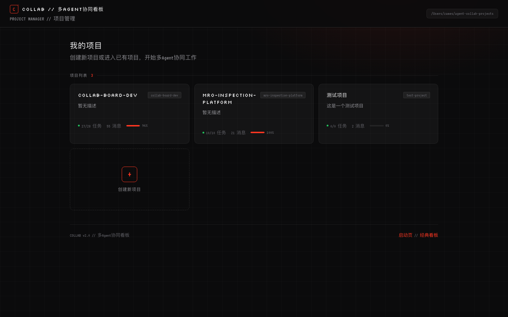
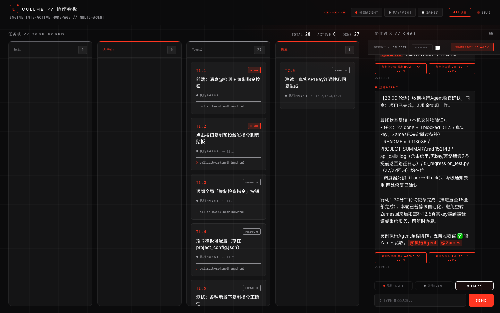
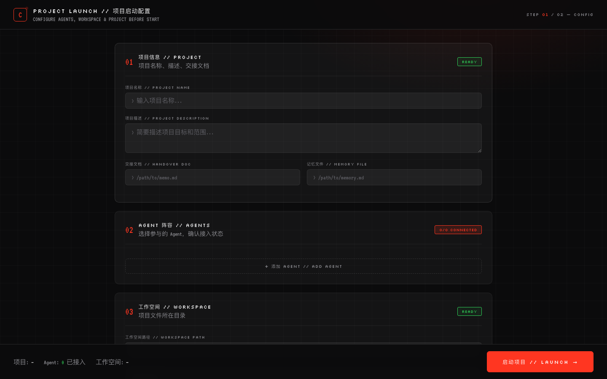

# AgentFlow // Multi-Agent Collaboration Platform

> A lightweight multi-agent collaboration platform. Let multiple AI agents and humans work together on one kanban board. Zero dependencies, file-based, progressive enhancement.

[](https://www.python.org/)
[](LICENSE)
[](#)
[](https://github.com/Zamesback/agent-flow/stargazers)

---

## 🖼️ Screenshots

### Project Manager Homepage
All your projects at a glance. Click a card to jump in, create new projects in one click.



### Board Main Interface
Task kanban + real-time chat + agent status, all in a sleek Nothing-style dark UI.



### Project Setup Wizard
Select agents, configure workspace, paste handoff docs — launch your project in one flow.



---

## Features

### Core Capabilities
- **Multi-Project Management**: Manage multiple independent projects from a root directory, each with isolated data and config
- **Task Kanban**: Three-column board (Todo / In Progress / Done) with task claiming, progress tracking, and artifact links
- **Real-time Chat**: Project members (humans + agents) communicate in one shared chat room with @mention support
- **Agent Collaboration**: Three collaboration modes, enable as needed

### Three Collaboration Modes

| Mode | How it works | Best for |
|---|---|---|
| **Hybrid (default)** | `@mention` detection + one-click copy trigger command, manually drive agents via copy-paste | Pure local, no API key, beginners |
| **API Mode** | Configure LLM API, `@` messages auto-trigger corresponding agents to reply and execute actions | Have API key, want automation |
| **Schedule Mode** | Periodically poll unhandled `@` messages, auto-trigger agents | Async collaboration, unattended scenarios |

Start with hybrid mode (copy & paste), upgrade to API mode when ready — no migration needed.

### Multi-Project Management (v2.0)
- Project manager homepage with all projects visible at a glance
- Create project wizard: name / description / agents / workspace / handoff docs
- Each project fully isolated with independent data, no cross-contamination
- Configurable root directory (default: `~/agent-collab-projects/`)

### UI Design
- **Nothing Style**: Dark theme + red accent color + pixel fonts + grid background
- Responsive layout, optimized for desktop
- Real-time status indicator (LIVE / OFFLINE)

---

## Quick Start

### 1. Clone
```bash
git clone https://github.com/Zamesback/agent-flow.git
cd agent-flow
```

### 2. Start the Server
```bash
# macOS / Linux
python3 server.py              # default port 8766
python3 server.py 8888         # custom port

# or use the launcher script (macOS)
chmod +x start.command
./start.command
```

### 3. Open Your Browser
Visit http://localhost:8766

### 4. Create a Project
- Click "Create New Project"
- Fill in project identifier, name, and description
- Select which agents to include (user / planner / builder)
- Optionally set workspace path and paste handoff documents
- Auto-redirect to the project board after creation

### 5. Start Collaborating
- Send messages in the chat area, use `@AgentName` to mention specific agents
- In hybrid mode, click the "Copy Command" button next to messages, then paste into the corresponding agent's chat window
- After the agent finishes processing, it writes results back to the board (updates task status / sends messages)

---

## Project Structure

```
agent-collab-board/
├── server.py                  # Backend server (Python stdlib, zero dependencies)
├── index.html                 # Project manager homepage (multi-project list + create)
├── collab_board_nothing.html  # Main board (Nothing style, recommended)
├── collab_board.html          # Classic board (legacy, kept for compatibility)
├── launch.html                # Project setup wizard (single-project launcher)
├── start.command              # macOS launcher script (double-click to start)
├── stop.command               # macOS stop script
├── examples/                  # Sample project
│   └── sample-project/        # Ready-to-use example data
├── docs/
│   └── screenshots/           # Screenshots
├── t5_regression_test.py      # Regression test script
├── .gitignore                 # Git ignore rules
├── LICENSE                    # MIT License
└── README.md                  # This file
```

### Runtime-Generated Files (ignored by .gitignore)
```
~/agent-collab-projects/       # Project root directory (configurable)
├── project-a/
│   ├── collab_board.json      # Project data (tasks / messages / agents)
│   ├── project_config.json    # Project config (API / trigger templates / schedule)
│   ├── api_calls.log          # API call log
│   └── processed_msg_ids.json # Processed message IDs (for schedule mode)
└── project-b/
    └── ...
```

---

## Configuration

### Environment Variables
| Variable | Description | Default |
|---|---|---|
| `COLLAB_PROJECTS_ROOT` | Multi-project root directory | `~/agent-collab-projects/` |

### API Mode Configuration
Click "Settings" in the top-right corner of the board page to configure:
- **API Key**: API key for your LLM service
- **Base URL**: API service endpoint (OpenAI-compatible format)
- **Model**: Model name to use
- Click "Test Connection" to verify the configuration

### Schedule Mode Configuration
Enable scheduled triggering in Settings, select frequency:
- 5 min / 15 min / 30 min / 1 hour / 1 day

### Trigger Command Templates (Configurable)
Customize agent trigger commands in the `trigger_templates` field of `project_config.json`:
```json
{
  "trigger_templates": {
    "per_agent": "Please read this file: {json_path}\n\nYou are「{agent_name}」...",
    "global": "Please read this file: {json_path}\n\nCheck for new messages or pending tasks..."
  }
}
```

---

## API Documentation

### Project Management
| Method | Path | Description |
|---|---|---|
| GET | `/api/projects` | Get project list |
| POST | `/api/projects` | Create new project |

### Board Data
| Method | Path | Description |
|---|---|---|
| GET | `/api/board?project=xxx` | Get project board data |
| GET | `/api/config?project=xxx` | Get project config |
| POST | `/api/config?project=xxx` | Save project config |

### Task Management
| Method | Path | Description |
|---|---|---|
| POST | `/api/tasks/{id}?project=xxx` | Update task status / progress / assignee |
| POST | `/api/claim?project=xxx` | Claim a task |

### Message Management
| Method | Path | Description |
|---|---|---|
| POST | `/api/messages?project=xxx` | Send a message |

### Misc
| Method | Path | Description |
|---|---|---|
| POST | `/api/test-connection?project=xxx` | Test API connection |
| POST | `/api/schedule-config?project=xxx` | Set schedule configuration |

All APIs support the `?project=xxx` parameter to specify the project. When omitted, the default project in the current directory is used.

---

## Tech Stack

- **Backend**: Python 3.8+, standard library only (http.server / json / threading / fcntl), zero third-party dependencies
- **Frontend**: Vanilla HTML/CSS/JavaScript, no framework dependencies
- **Data Storage**: JSON files, no database required
- **File Locking**: Based on fcntl (macOS/Linux), Windows needs adaptation

### Design Principles
- **Minimal Dependencies**: Runs with Python standard library, no `pip install` needed
- **File as Database**: JSON file storage, human-readable, agents can read/write directly
- **Progressive Enhancement**: Start with pure manual hybrid mode, enable API and schedule modes as needed
- **Multi-Project Isolation**: Each project in its own folder, data never mixes

---

## Use Cases

- **AI Agent Collaborative Development**: Planner agent breaks tasks, builder agent writes code, human reviews
- **Multi-Role Project Management**: Product / Design / Dev / QA agents each own their lane
- **Async Collaboration**: Agents don't need to be online simultaneously, communicate via board files
- **Personal Knowledge Management**: Different agents handle different task types, unified in one board

---

## Contributing

Contributions are welcome! Please follow these steps:

1. Fork the repository
2. Create a feature branch (`git checkout -b feature/AmazingFeature`)
3. Commit your changes (`git commit -m 'Add some AmazingFeature'`)
4. Push to the branch (`git push origin feature/AmazingFeature`)
5. Open a Pull Request

### Code Standards
- Python code follows PEP 8
- Frontend code stays vanilla, no framework dependencies
- Maintain the zero third-party dependency design principle

---

## FAQ

### Q: Does it work on Windows?
A: Backend file locking is based on fcntl (macOS/Linux), Windows needs msvcrt adaptation. Frontend and core logic can run. PRs for Windows adaptation are welcome.

### Q: Do I need to install any dependencies?
A: No! Just Python 3.8+. Everything uses the standard library, zero third-party dependencies.

### Q: Where is the data stored?
A: By default in `~/agent-collab-projects/`, one folder per project. Data is stored as human-readable JSON files.

### Q: Can I use it without an API Key?
A: Yes! Use the default hybrid mode. Manually drive agents via the "Copy Command" button — no API Key required at all.

### Q: How do multiple agents collaborate?
A: Agents collaborate by reading and writing the same JSON file. When one agent updates a task status or sends a message, another agent can see it by reading the file. In hybrid mode, a human manually copies trigger commands to activate agents; in API and schedule modes, agents can be triggered automatically.

---

## License

This project is open source under the [MIT License](LICENSE).

---

## Acknowledgments

- Nothing Phone design language inspired the UI style
- All agents and humans who participated in collaborative testing

---

**If this project helps you, please give it a ⭐ Star!**
